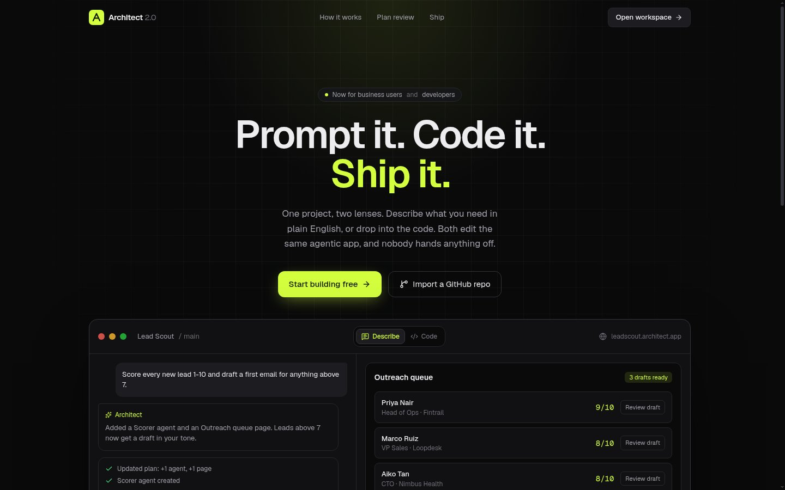
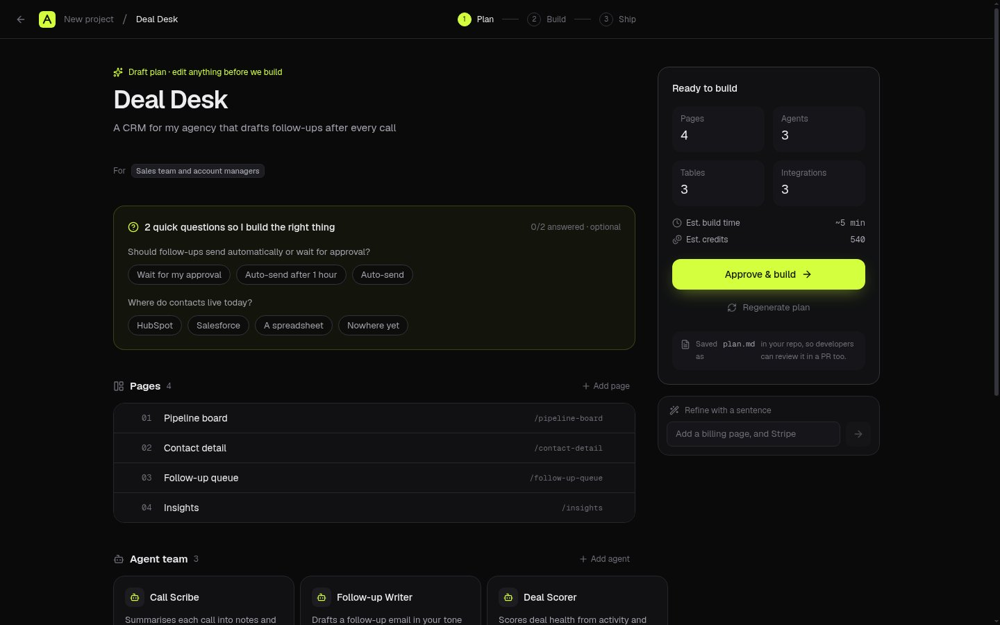
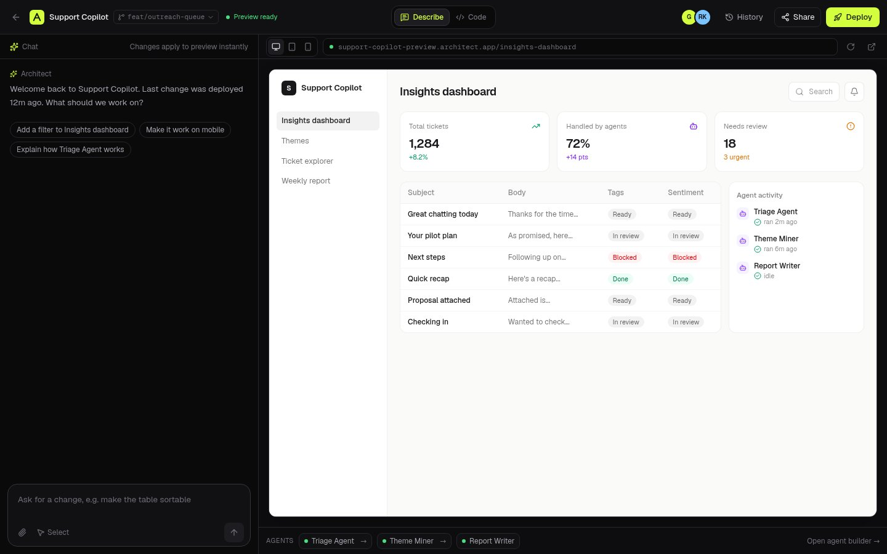
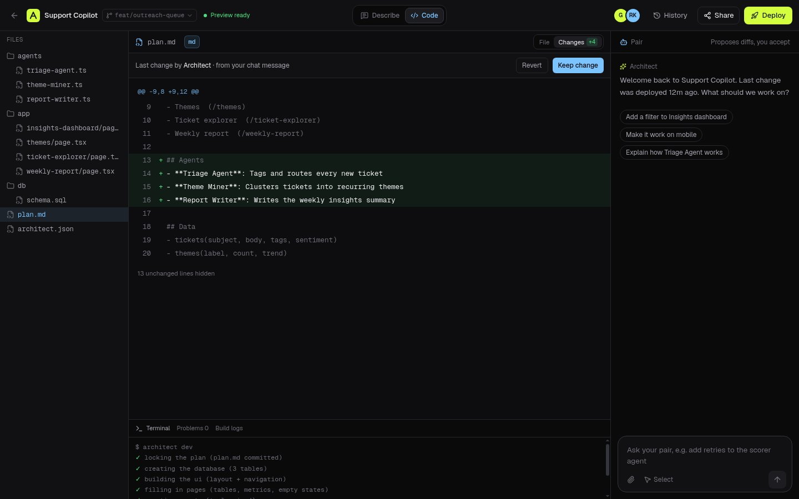
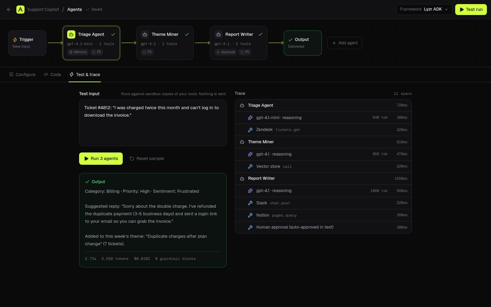
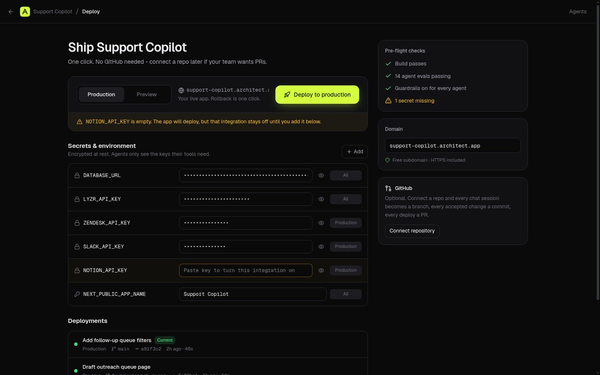

# Architect 2.0

**Prompt it. Code it. Ship it.** A concept for the next version of [Architect](https://architect.new): a vibe-coding platform built for business users *and* developers.

**Live demo:** https://architect-2-black.vercel.app - click **Explore without an account** to go straight in.



## The idea: one project, two lenses

Most prompt-to-app tools are built for one kind of person. Chat-first builders suit people who describe what they want; AI code editors suit people who write code. Real teams have both, and the handoff between them is where projects stall.

Architect 2.0 gives every project two lenses on the same source of truth:

- **Describe lens** - chat, live preview, plain-English agent cards. For the person who owns the problem.
- **Code lens** - file tree, AI diffs you keep or revert, terminal, env. For the person who owns the system.

A change made in one lens shows up in the other. Nobody exports, re-prompts or rewrites.

## Walkthrough (about 3 minutes)

1. **Sign in** - GitHub, Google, or "Explore without an account". Onboarding asks one question (describe or code) and only sets your default lens.
2. **Home** - describe an app, import a repo, or start from a template. Press <kbd>⌘K</kbd> anywhere to search, jump, or type an idea and build it.
3. **Plan review** - your prompt becomes an editable spec: pages, agents, data tables, integrations, plus two optional clarifying questions. Nothing is built until you approve.

   

4. **Workspace, Describe lens** - chat on the left, live preview on the right with desktop/tablet/phone sizes. Use **Select** to point at any part of the app and change it. **History** restores any version, **Share** sends a preview link where people leave comments pinned to the screen.

   

5. **Workspace, Code lens** - same project: files, editor, terminal, and a pair panel that proposes diffs. Every AI change opens as a diff you can keep or revert.

   

6. **Agent builder** - the agents as a flow (trigger → agents → output). Edit instructions in plain English, pick tools and model, set guardrails (PII redaction, human approval, memory, cost cap). Export the same agents to **Lyzr ADK, LangGraph, CrewAI, OpenAI Agents SDK or Google ADK** and see the code change live. **Test run** shows a full trace: every agent, model call and tool call with timing, tokens and cost.

   

7. **Deploy** - one click to preview or production, no GitHub required. Pre-flight checks, a secrets editor that flags missing keys, a streaming build log, custom domains, and one-click rollback.

   

8. **Repo import** - pick a repo and get a read-only analysis first: stack, routes, agents found, env vars found or missing, and what's worth fixing. Then open it in either lens.

Everything works on a phone too: bottom tab bar, sticky primary actions, and a Chat/Preview switch in the workspace.

## Key product decisions

1. **Plan before build.** The most common failure of prompt-to-app tools is building the wrong thing confidently. A 30-second review of an editable spec is cheaper than three rounds of "no, not like that".
2. **Lens is a preference, not a product tier.** Business users and developers get the same projects, the same permissions model and the same history. Only the default view changes.
3. **Agents are first-class, and portable.** Agents live in their own builder with guardrails and traces, and export to the major frameworks, so teams aren't locked in.
4. **Safe by default.** Test runs use sandboxed tools, guardrails are on for every agent, secrets are scoped per agent, and every deploy can be rolled back.
5. **GitHub is optional, not required.** Ship without a repo; connect one later and each chat session becomes a branch and each deploy a PR.

## What's real vs. simulated

This is a design and product prototype. The UI, navigation, state, lens switching, plan editing, agent configuration, framework code generation, history, sharing and comment pins all work in the browser. Plan generation, builds, agent runs and deploys are simulated with realistic data so the full flow can be judged without API keys. GitHub/Google sign-in is wired with Auth.js and turns on when OAuth credentials are set.

## Stack

Next.js (App Router) · React 19 · TypeScript · Tailwind CSS v4 · Motion · Lucide · Auth.js · deployed on Vercel.

```bash
npm install
npm run dev
# optional, for real sign-in:
# AUTH_SECRET=... AUTH_GITHUB_ID=... AUTH_GITHUB_SECRET=... AUTH_GOOGLE_ID=... AUTH_GOOGLE_SECRET=...
```

---
Built by Sachin Yadav as a hiring-assignment prototype. Not an official Lyzr product.
